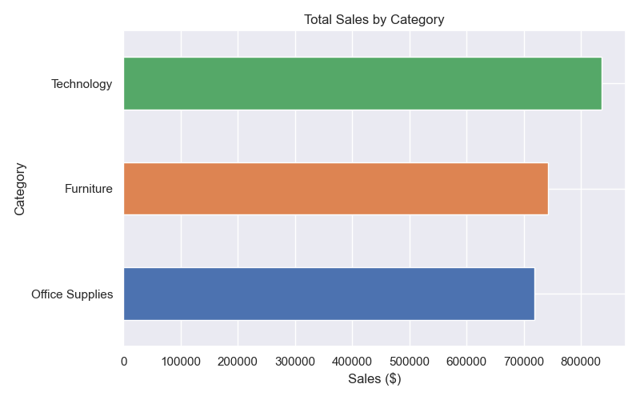
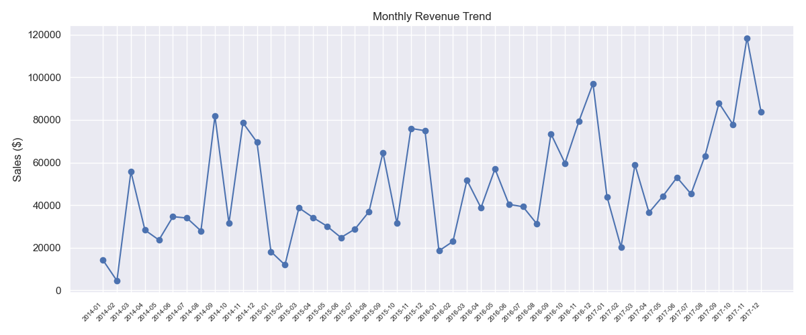
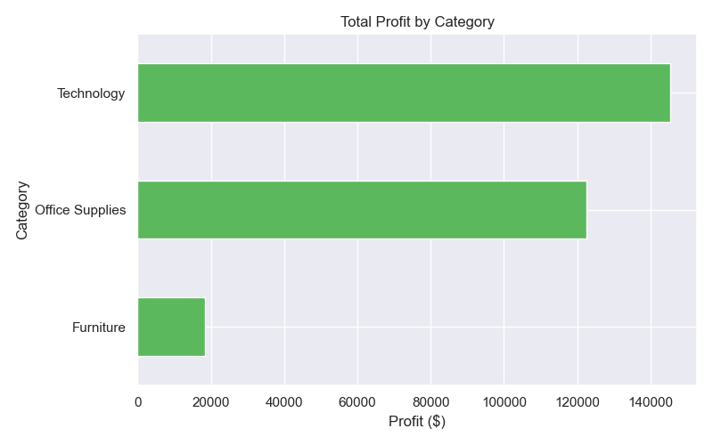
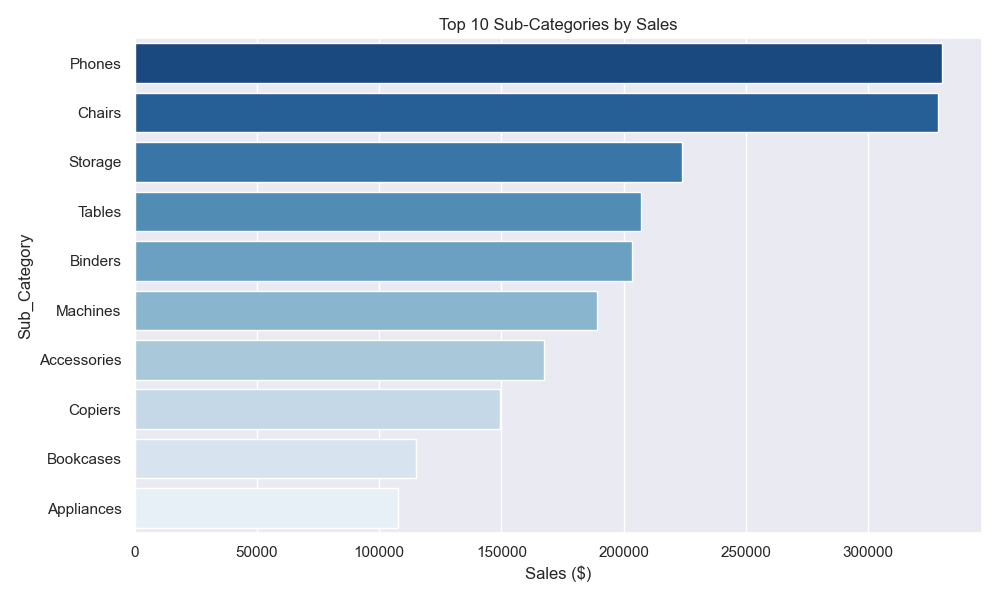
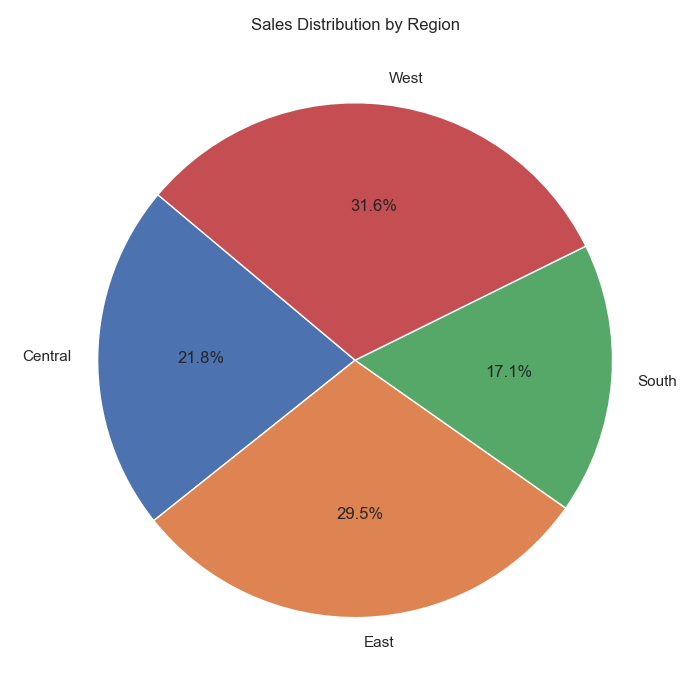

 # 🛒 Superstore Sales Analytics Dashboard

> End-to-end data analytics project using MySQL, Python, and Power BI on the Superstore Sales dataset.

---

## 📊 Project Overview

This project simulates a real-world business intelligence workflow — from raw data ingestion to an interactive executive dashboard. It covers the full data analyst pipeline: data cleaning, SQL analysis, Python EDA, and Power BI visualization.

---

## 🎯 Key Business Insights

| Metric | Value |
|---|---|
| 💰 Total Revenue | $2,297,200.86 |
| 📈 Total Profit | $286,397.02 |
| 📊 Profit Margin | 12.47% |
| 🛒 Total Orders | 5,009 |
| 🧾 Avg Order Value | $458.61 |

- **Technology** is the most profitable category ($145K profit)
- **Furniture** has high sales but very low profit ($18K) — pricing issue
- **West region** leads sales at 31.58%
- **Machines & Fasteners** are loss-making sub-categories
- Revenue shows clear **upward growth trend** from 2014 to 2017

---

## 🛠️ Tools & Technologies

| Tool | Purpose |
|---|---|
| MySQL | Database setup, data import, SQL queries |
| Python (Pandas, Matplotlib, Seaborn) | Data cleaning, KPI computation, chart generation |
| Power BI Desktop | Interactive dashboard & data visualization |
| GitHub | Version control & portfolio hosting |

---

superstore-sales-analytics/
│
├── clean.py                  # Data cleaning script
├── analyze.py                # KPI computation & chart generation
├── queries.sql               # MySQL analytical queries
├── requirements.txt          # Python dependencies
├── superstore_clean.csv      # Cleaned dataset (9,994 rows)
├── superstore_dashboard.pbix # Power BI dashboard file
│
└── charts/
    ├── 1_sales_by_category.png
    ├── 2_monthly_trend.png
    ├── 3_profit_by_category.png
    ├── 4_top_subcategories.png
    └── 5_sales_by_region.png

## 🔄 Workflow

### Step 1 — Data Cleaning (Python)
- Loaded raw CSV with `pandas`
- Fixed date formats from `MM/DD/YYYY` to `YYYY-MM-DD`
- Cleaned column names (removed spaces)
- Exported clean CSV for MySQL import

### Step 2 — SQL Analysis (MySQL)
- Created `bi_sales_platform` database
- Imported 9,994 rows into `orders` table
- Ran analytical queries:
  - Total revenue & profit
  - Sales by category
  - Top 5 states by revenue

### Step 3 — Python EDA & Visualization
- Computed KPIs: revenue, profit, margin, orders, avg order value
- Generated 5 charts: category sales, monthly trend, profit by category, top sub-categories, regional distribution

### Step 4 — Power BI Dashboard
- Connected to cleaned CSV
- Built interactive dashboard with:
  - 4 KPI cards
  - Monthly revenue trend line chart
  - Sales by category bar chart
  - Profit by sub-category bar chart
  - Sales by region pie chart
  - Region, Segment & Date Range slicers

---

## 📸 Dashboard Preview







---

## 🚀 How to Run

### Python Scripts
```bash
# Install dependencies
pip install pandas numpy matplotlib seaborn

# Clean the data
python clean.py

# Generate analysis & charts
python analyze.py
```

### Power BI Dashboard
1. Open `superstore_dashboard.pbix` in Power BI Desktop
2. If prompted, update the CSV file path to your local path
3. Interact with slicers to filter by Region, Segment, and Date

---

## 📦 Dataset

- **Source:** [Superstore Sales Dataset - Kaggle](https://www.kaggle.com/datasets/vivek468/superstore-dataset-final)
- **Rows:** 9,994 orders
- **Period:** 2014 - 2017
- **Region:** United States

---

## 👤 Author

**Kavi Gamage**
- GitHub: [@kavigamage-da](https://github.com/kavigamage-da)

---

*This project is part of my data analytics portfolio demonstrating end-to-end BI skills.*
